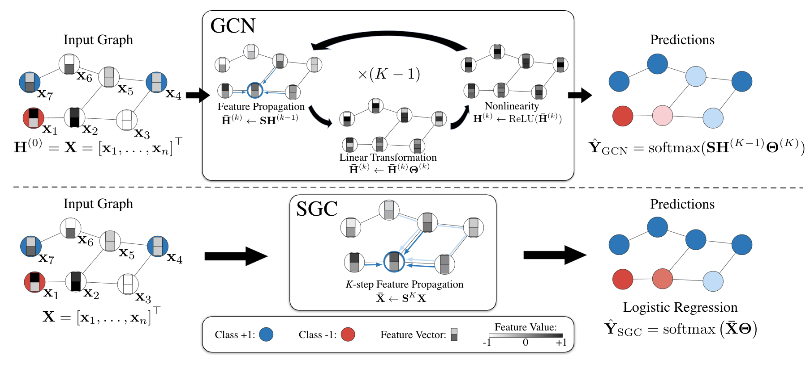
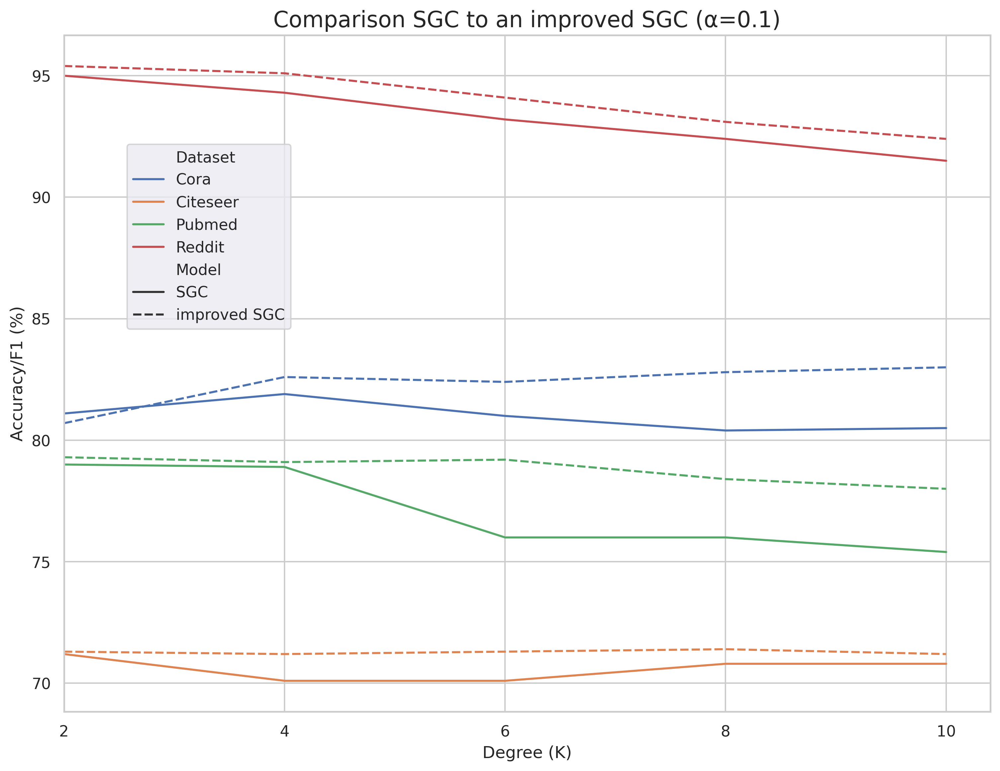

<div align="center">

# Simplifying Graph Convolutional Networks

[](https://github.com/pre-commit/pre-commit)
[](https://pytorch.org/get-started/locally/)
[](https://pytorchlightning.ai/)
[](https://github.com/ashleve/lightning-hydra-template#license)
[](https://colab.research.google.com/github/chnk58hoang/SGC_Lightning/blob/main/notebook/SGC.ipynb)

</div>

## Overview
This repo contains an implementation and an improved version of the Simple Graph Convolution
(SGC) model, described in the ICML2019 paper [Simplifying Graph Convolutional Networks](https://arxiv.org/abs/1902.07153).

In general, SGC removes the nonlinearities and collapes the weight matrices in Graph Convolutional Networks (GCNs) and is essentially a linear model. 
For an illustration, 

This home repo contains the implementation for citation networks (Cora, Citeseer, and Pubmed) and social network (Reddit).

## Datasets
We provide the citation network datasets under `data/`, which corresponds to [the public data splits](https://github.com/tkipf/gcn/tree/master/gcn/data).
Due to space limit, please download reddit dataset from [FastGCN](https://github.com/matenure/FastGCN/issues/9#issuecomment-454448523) and put `reddit_adj.npz`, `reddit.npz` under `data/`.

Details about the datasets are shown below:

<div align="center">

Dataset | # Nodes | # Edges | # Features | # Classes | Train/Dev/Test Nodes
:------:|:-------:|:-------:|:----------:|:---------:|:-------------------:
Cora    | 2,708   | 5,429   | 1,433      | 7         | 140/500/1,000
Citeseer| 3,327   | 4,732   | 4,732      | 6         | 120/500/1,000
Pubmed  | 19,717  | 44,338  | 500        | 3         | 60/500/1,000
Reddit  | 233K    | 11.6M   | 602        | 41        | 152K/24K/55K

</div>

## Results

### Plain SGC

SGC achieves competitive performance while saving much training time. For reference, on a Tesla T4 (Google Colab's GPU),

<div align="center">

Dataset | Model | Metric | Training Time
:------:|:------:|:------:|:-----------:
Cora    | SGC (authors)<br>SGC (*ours*) | Acc: 81.0 %<br>Acc: 81.1 %    | 0.79s<br>0.83s 
Citeseer| SGC (authors)<br>SGC (*ours*) | Acc: 71.9 %<br>Acc: 71.2 %     | 0.78s<br>0.89s 
Pubmed  | SGC (authors)<br>SGC (*ours*) | Acc: 78.9 %<br>Acc: 79.0 %     | 0.75s<br>0.70s 
Reddit  | SGC (authors)<br>SGC (*ours*) | F1:  95.0 %<br>F1: 95.0 %     | 1.57s<br>25.31s 

</div>

About the run time of our implementation, it seems that PyTorch Lightning is having some [issues](https://github.com/Lightning-AI/lightning/issues/10389) making the training time longer than that of pure PyTorch. We are still underway to work on this problem.

### Improved SGC
With K increases, the performance of SGC degrades. To address this issue, we propose to use a balanced weight parameter, to balance the pre-processed feature $\mathbf S^K \mathbf X$ and the original feature $\mathbf X$. 

$$\hat Y_{\textrm{SGC}}^\star = [(1-\alpha)\mathbf S^K \mathbf X + \alpha \mathbf X] \Theta$$

The results are illustrated below:

<div align="center">
  
</div>

## Installation
You should have Python 3.7 or higher. I highly recommend creating a virual environment like venv or [Conda](https://docs.conda.io/en/latest/miniconda.html). For example, to install with Conda:


```
git clone https://github.com/chnk58hoang/SGC_Lightning.git
cd SGC_Lightning
conda create -n sgc python=3.8
conda activate sgc
pip install -e .
```

## Usage
To run the code, go to the `egs` folder and execute [`run.py`](./egs/run.py):

```
$ python run.py --help
usage: run.py [-h] [--seed SEED] [--no-cuda] [--lightning] config

positional arguments:
  config       Path to yaml config file.

optional arguments:
  -h, --help   show this help message and exit
  --seed SEED  Random seed.
  --no-cuda    Disables CUDA training.
  --lightning  Execute with PyTorch Lightning version.
```

Example of a `config.yaml` file can be found in `configs/`

## References
1. Simplifying Graph Convolutional Networks ([paper](https://arxiv.org/abs/1902.07153), [official code](https://github.com/Tiiiger/SGC/))
